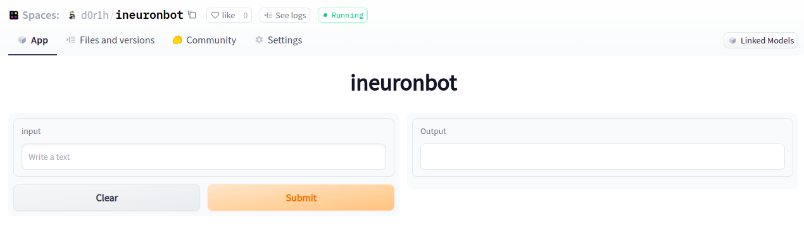

Conversational AI Chat-Bot in in Keras and Huggingface 
#

Deployment Link : https://huggingface.co/spaces/d0r1h/ineuronbot

Task we carried out during the hackathon

1. Clean and parse the data 
2. Build Encoder-Decoder Model
3. Used GPT model as a final deployment

### Dataset:

1. Clean dataset can be accessed [here](https://drive.google.com/file/d/11qLxSxY0v_I0Lleo5sXFNyxtKypWL_Gl/view?usp=sharing)
2. Following image is the snapshot of processed dataset

#

### Application

### Notebook:

Following notebook contains the code for data parsing and enc-dec model.

| Notebook | Colab | 
| ------ | ------ | 
| notebook |  |

